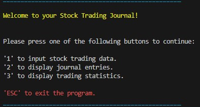

# **Stock Trading Journal**

Live Website: [Stock Trading Journal - Not Yet Deployed](https://nixts)

The Stock Trading Journal is a Python application designed to help daytraders manage and analyze their stock trading activities. This terminal-based app integrates with Google Sheets, allowing users to input trading data, view their past trades, and access statistics.

## **Project Goals**

The project's primary goal is to maintain a minimalist and straightforward terminal-based design. It prioritizes simplicity and efficiency in user interactions. This design philosophy ensures that users can quickly and intuitively enter their stock trading data without any unnecessary complexity. Input validation mechanisms are implemented to guarantee data accuracy, minimizing errors and ensuring the integrity of the trading records. Unnecessary elements or features that could clutter the interface are intentionally omitted, keeping the user experience focused and efficient. The ultimate aim is to provide traders with a clean, distraction-free tool that simplifies data management, fostering a seamless and hassle-free experience for users.

## **User Goals**

### **First Time Users Goals**

+ As a first time User, I want to easily navigate my Stock Trading Journal.
+ As a first time User, I want to learn the interface very quick.
+ As a first time User, I want to see my past trades.

### **Frequent User Goals**

+ As a frequent User, I want to see todays and all my past trades.
+ As a frequent User, I want to see my trading statistics.
+ As a frequent User, I want to be as efficient as possible when using the app.

### **All User goals**

+ As a User, I want to input stock trading data without the danger of pushing incorrect data.
+ As a User, I want to access this app from anywhere.
+ As a User, I dont want the app to use a lot of rescources from my machine.

### **Fulfillment**

The terminal-based app is controlled with direct keyboard input with input validation, no incorrect data can be put in.
> As a first time User, I want to easily navigate my Stock Trading Journal.
> As a first time User, I want to learn the interface very quick.

A user-configurable feature has been added, enabling users to specify a desired number of past trades for viewing.
> As a first time User, I want to see my past trades.

A feature has been added, allowing Users to see all their past trades.
> As a frequent User, I want to see todays and all my past trades.

The option to display a certain number of trades, todays or all time trades statistic is implemented. Showing number of trades, profit/loss, number of long/short, number of winning/losing trades and win-loss-ratio.
> As a frequent User, I want to see my trading statistics.

The Terminal based app with direct keyboard input and input validation allows lightning fast controll over the app without having the danger of putting in incorrect data.
> As a frequent User, I want to be as efficient as possible when using the app.

> As a User, I want to input stock trading data without the danger of pushing incorrect data.

This app is deployed to a cloud based service and connected to a google sheet on the google cloud, allowing access from anywhere in the world.
> As a User, I want to access this app from anywhere.

As a cloud-based application featuring a terminal interface, this software 
uses minimal resource, making it exceptionally resource-efficient.
> As a User, I dont want the app to use a lot of rescources from my machine.

## **Structure**

### **Navigation**

+ After starting the Stock Trading Journal the user will be greeted by a short welcoming message.
+ Options are given to navigate the app by pressing buttons on the keyboard with direct input.
+ Each option has a short description of where this navigation leads to.
+ An option to close the application by pressing the ESC button in the main menues.

**Starting Screen**  

**Input Stock Trading Data**  

**Display Journal Entries**  

**Display Trading Statistics**  

### **Input**

## **Features**

### **Existing Features**

### **Features left to implement**

## **Technologies**

### **Core technologies**

+ Python
  + This project uses python ...
+ [Codeanywhere](https://app.codeanywhere.com/)
  + Codeanywhere is a cloud-based integrated development environment (IDE) that allows developers to collaborate, write, and execute code from anywhere.
+ [GitHub](https://github.com/)
  + GitHub is the hosting website used to store the source code for the website and [Git Pages](https://pages.github.com/) is used for the deployment of the live website.
+ [Git](https://git-scm.com/)
  + Git is used as version control software to commit and push code to the GitHub repository where the source code is stored.
+ [Lucid Charts --- Link needed]()
  + A

### **Implemented Technologies** 

## **Testing**

### **Procedure**

### **Input Validation**

### **Functionality**

### **Validator testing**

### **Unresolved Errors, Issues and Bugs**

## **Deployment**

### **Project Creation**

The project was started by navigating to the [template --- link needed](https://github) and clicking 'Use this template'. Under Repository name I input woodworking-club and checked the 'Include all branches' checkbox. I then navigated to the new [repository --- link needed](). I then clicked the Code drop down and selected HTTPS and copied the link to the clipboard.

Opening [Codeanywhere](https://app.codeanywhere.com/) and clicking 'New Workspace', I then pasted the [repository link --- link needed](https://github) into the URL field and clicked 'Create'. The following commands were used throughout the project:

+ git add filename - This command was used to add files to the staging area before committing.
+ git commit -m *commit message explaining the updates* - This command was used to commit changes to the local repository.
+ git push - This command is used to push all committed changes to the GitHub repository.

### **Run Locally**

### **Deployment**

## **Credits**

### **Content**

### **Acknowledgements**
