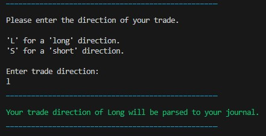

# **Stock Trading Journal**

Live Website: [Stock Trading Journal - Not Yet Deployed](https://nixts)

The Stock Trading Journal is a Python application designed to help daytraders manage and analyze their stock trading activities. This terminal-based app integrates with Google Sheets, allowing users to input trading data, view their past trades, and access statistics.

## **Project Goals**

The project's primary goal is to maintain a minimalist and straightforward terminal-based design. It prioritizes simplicity and efficiency in user interactions. This design philosophy ensures that users can quickly and intuitively enter their stock trading data without any unnecessary complexity. Input validation mechanisms are implemented to guarantee data accuracy, minimizing errors and ensuring the integrity of the trading records. Unnecessary elements or features that could clutter the interface are intentionally omitted, keeping the user experience focused and efficient. The ultimate aim is to provide traders with a clean, distraction-free tool that simplifies data management, fostering a seamless and hassle-free experience for users.

## **User Goals**

### **First Time Users Goals**

+ As a first time User, I want to easily navigate my Stock Trading Journal.
+ As a first time User, I want to learn the interface very quick.
+ As a first time User, I want to see my past trades.

### **Frequent User Goals**

+ As a frequent User, I want to see todays and all my past trades.
+ As a frequent User, I want to see my trading statistics.
+ As a frequent User, I want to be as efficient as possible when using the app.

### **All User goals**

+ As a User, I want to input stock trading data without the danger of pushing incorrect data.
+ As a User, I want to access this app from anywhere.
+ As a User, I dont want the app to use a lot of rescources from my machine.

### **Fulfillment**

The terminal-based app is controlled with keyboard input with input validation, no incorrect data can be put in.
> As a first time User, I want to easily navigate my Stock Trading Journal.
> As a first time User, I want to learn the interface very quick.

A user-configurable feature has been added, enabling users to specify a desired number of past trades for viewing.
> As a first time User, I want to see my past trades.

A feature has been added, allowing Users to see all their past trades.
> As a frequent User, I want to see todays and all my past trades.

The option to display a certain number of trades, todays or all time trades statistic is implemented. Showing number of trades, profit/loss, number of long/short, number of winning/losing trades and win-loss-ratio.
> As a frequent User, I want to see my trading statistics.

The Terminal based app with keyboard input and input validation allows lightning fast control over the app without having the danger of putting in incorrect data.
> As a frequent User, I want to be as efficient as possible when using the app.

> As a User, I want to input stock trading data without the danger of pushing incorrect data.

This app is deployed to a cloud based service and connected to a google sheet on the google cloud, allowing access from anywhere in the world.
> As a User, I want to access this app from anywhere.

As a cloud-based application featuring a terminal interface, this software 
uses minimal resource, making it exceptionally resource-efficient.
> As a User, I dont want the app to use a lot of rescources from my machine.

## **Structure**

### **Navigation**

+ After starting the Stock Trading Journal the user will be greeted by a short welcoming message.
+ Options are given to navigate the app by pressing buttons on the keyboard with direct input.
+ Each option has a short description of where this navigation leads to.
+ An option to close the application by pressing the ESC button in the main menues.

**Starting Screen**  

**Input Stock Trading Data**  

**Display Journal Entries**  

**Display Trading Statistics**  

### **Trading Journal Input**

+ Inputs can only be made with the keyboard.
+ Input is validated wherever an input can be made, so that it fits the google sheet.
+ Input validation testing can be seen in the testing section.

**Input for dates**
+ First, the user has to decide if they want to push the current date or enter a date manually.

+ When users opt to automatically enter the current date, a green-colored confirmation message will be displayed, indicating that the date input was successful.

+ When users opt to manually enter a date, the program enforces a specific date format to ensure data consistency. Upon successful entry in the correct format, a green-colored confirmation message will be displayed, indicating that the date input was successful.

**Input for Stock Ticker Symbol**
+ Following the date entry, the user is prompted to input a stock ticker symbol, which must consist of 1 to 4 letters. Upon correct entry, the input is automatically converted to uppercase letters for standardized data handling.

**Input for Shares Amount**
+ Next, users are prompted to input the number of shares, which is restricted to positive numbers only. Upon successful entry, a green confirmation message will display the entered share amount for user validation.

**Input Trade Direction**
+ Upon entering a trade direction with a single letter ("l" for long or "s" for short), the complete word ("Long" or "Short") will be displayed in the confirmation message, and it will also be parsed to the journal for clarity and consistency.

  

**Input Prices**
+ The input for both entry and exit prices exclusively accepts numbers with exactly two decimal places. After successful entry, a green confirmation message will be shown, displaying both the entry and exit prices for user verification.

**Displaying Journal Entry**
+ The final step in the process involves displaying a table containing all the entered data entries. The user is prompted to review the information and confirm if it is accurate. If the data is indeed correct, the program will request user confirmation to push the data to the journal or start the process again.

**Entry is correct**
+ If the entry is correct and Y is entered, the entry will be pushed to the journal, in this case a google sheet.

**Data is incorrect**
+ If the entry is incorrect and N is entered, the entry will be deleted and the input sequence starts again.

### **Display Trading Journal**

+ Three options given to display trading journal
    1. Entering a specific number of past trade to be displayed
    2. Displaying trades that match the current date
    3. Displaying all trades

**1.** **Entering a specific number of past trades**

+ Users have the option to input a specific number to request the display of a corresponding amount of past trades.

**2.** **Display Todays Trades**

+ User have the option to display trades, that match the current date.

**3.** **Display All Trades**

+ Furthermore, users have the capability to display all trades stored within the journal. 

### **Display Trading Statistic**

+ Three options given to display trading statistics
    1. Entering a specific number of past trades statistics to be displayed
    2. Displaying trades statistics that match the current date
    3. Displaying all trades statistics

**1.** **Entering a specific Number of Past Trades Statistics**

+ Users have the option to input a specific number to request the display of a corresponding amount of past trades.

**2.** **Display Todays Trades Statistics**

+ User have the option to display trades, that match the current date.

**3.** **Display All Trades Statistics**

+ Furthermore, users have the capability to display all trades stored within the journal. 

## **Features**

### **Existing Features**

**Program**
+ Terminal based for quick responsiveness
+ Sorting google sheet after every entry if an older date was pushed
+ A close program function when pressing ESC while in main menu
+ Asks to return to menu on button press '1'

**Inputs**
+ This program uses keyboard inputs for quick navigation
+ Data input to fill out a google sheet
+ Input validation for input fields to minimize incorrect data entries

**Display past Trades**
+ Three options to choose from when displaying past trades
+ Specify a number of past trades to show in a table
+ Show todays trades in a table
+ Show all trades in a table

**Get Statistics**
+ Three options to choose from when displaying past trades statistics
+ Specify a number of past trades statistics
+ Show todays trades statistic
+ Show all trades statistics
+ Shows number of trades, profit/loss, number of long/short, number of winning/losing trades and win-loss-ratio.

### **Features left to implement**

+ API connection to brokerage software to automate the process of entering trades.
> Given the relatively low daily trade volume, implementing automation would not yield a cost-effective solution for this scenario.

+ A delete past trades function will be implemented in the future.
> Due to very strict input validation, a delete past trades is not necessary yet.

+ Return to main menu function.
> Due to the relatively small scope of this program, a return to the main menu function was deemed  as unneccessary.

## **Technologies**

### **Language**

+ [Python](https://www.python.org/)
    - Main programming language used in this project

### **Libraries**

+ [Colorama](https://pypi.org/project/colorama/)
    - Used to color terminal text
+ [Tabulate](https://pypi.org/project/tabulate/)
    - Used to create tables in the terminal
+ [GSpread](https://docs.gspread.org/en/v5.10.0/)
    - Python API for google sheets
+ [Time](https://docs.python.org/3/library/time.html)
    - Provides various time-related functions
+ [Datetime](https://docs.python.org/3/library/datetime.html)
    - Used to manipulate times and dates
+ [RegEx](https://docs.python.org/3/library/re.html)
    - Used to further controle and validate inputs

### **Tools**

+ [PIP](https://pypi.org/project/pip/)
    - Package installer for Python
+ [Git](https://git-scm.com/)
    - Version control system
+ [GitHub](https://github.com/)
    - Used to store and manage code
+ [Heroku](https://dashboard.heroku.com/)
    - Used to deploy the project
+ [Visual Studio Code](https://code.visualstudio.com/)
    - Open source code editor
+ [Lucid Charts](https://www.lucidchart.com/pages/)
    - Data and chart visualization
+ [CI Python Linter](https://pep8ci.herokuapp.com)
    - Code quality advisor software for error and mistakes detection

## **Testing**

+ Thorough testing procedures were applied throughout the development lifecycle of the Stock Trading Journal program.
+ Following the implementation of each function, a testing regimen was conducted to assess not only its functionality but also its seamless integration with other program functions.
+ Testing criteria included evaluating the visibility and comprehensibility of user interfaces as well as the overall design integrity of the application.

### **Input Validation**

In this program are various methods for inputting data:

+ Using keyboard input for menu navigation.
+ Utilizing keyboard keys in scenarios where there are two or more predefined options.
+ Entering numerical values or sequences of letters when creating journal entries.

Each input field within the program is safeguarded against errors through one of the following mechanisms:

+ **Restricting input to specific keys, ensuring only permissible characters are accepted.**

Imposing constraints on the accepted input format, such as letters, numbers, numbers with decimals, specific dates like today or past dates thereby preventing invalid data entry.

+ **Validate Dates**  
    - In the image below, it's evident that dates must adhere to the correct format and can only be either today's date or a past date to be accepted.

+ **Validate Letters**  
    - The image below confirms that only letters from 'a' to 'z' and 'A' to 'Z' are accepted as input. Additionally, the input is automatically converted to uppercase to ensure valid and consistent stock ticker symbols in the trading journal.

+ **Validate Numbers**  
    - In the displayed image, only positive numerical input is accepted.

+ **Validate Numbers with Decimals**  
    - As depicted in the image below, only numerical inputs with precisely two decimals are accepted, ensuring uniform and consistent data entry.

### **Input Validation Testing**
Within every programming cycle, rigorous testing plays a pivotal role in development. To guarantee a top-notch user experience, user inputs must undergo thorough validation to eliminate any potential room for errors or mistakes. Given the substantial volume of user inputs this program anticipates, a meticulous testing approach has been implemented to ensure data accuracy and reliability.

Testing has been conducted the following way:
1. Running the programm
2. Following the instructions to enter various inputs
3. At every step the following inputs have been tested

| Input                       | Example use | Example use | Example use |
|-----------------------------|-------------|-------------|-------------|
| Numbers                     | 1           | 200         | 999         |
| Numbers w. decimals         | 10          | 50.05       | 99.95       |
| Dates in other formats      | yyyy.mm.dd  | mm.dd.yyyy  | dd/mm/yyyy  |
| Futures dates               | 31.01.2089  |             |             |
| Impossible dates            | 34.01.2022  |             |             |
| Letters uppercase           | ABC         |             |             |
| Letters lowercase           | abc         |             |             |
| correct input with addition | 100a        | ABC+        | 100§        |

As evident from the testing table below, various inputs have undergone thorough examination and validation.

Correct Input - Input is validated and confirmed with a green message. The program proceeds to the next stage.

Incorrect Input = The input is declined and a decline message in red is displayed. The program reacts and repeats the last input sequence until valid input is provided.

| **Input**          | **Expected Input**   | **Correct Input** | **Incorrect Input** |
|--------------------|----------------------|-------------------|---------------------|
| Navigation menues  | Numbers              | As expected       | As expected         |
| Date               | dd.mm.yyyy           | As expected       | As expected         |
| Ticker Symbol      | 1 - 4 letters        | As expected       | As expected         |
| Shares Amount      | Positive Number      | As expected       | As expected         |
| Long/Short         | L or S               | As expected       | As expected         |
| Entry/Exit price   | Number with two dec. | As expected       | As expected         |
| Confirmation       | Y / N                | As expected       | As expected         |
| Past trades amount | Numbers              | As expected       | As expected         |

### **Other Tests**

All Python files have been inspected using a pep8 linter, and no errors have been detected.

[Code Institue PEP8 Linter](https://pep8ci.herokuapp.com)

### **Unresolved Errors, Issues and Bugs**

To date, there are no known bugs or issues with this application.

## **Deployment**

### **Project Creation**

The project was started by navigating to the [template provided](https://github.com/Code-Institute-Org/p3-template) and clicking 'Use this template'. Under Repository name I input stock-trading-journal and checked the 'Include all branches' checkbox. I then navigated to the new [repository](https://github.com/NixTS/stock-trading-journal). I then clicked the Open with GitHub Desktop button.

After GitHub Desktop opened this repository i then clicked "Open in Visual Studio Code"

Opening [Visual Studio Code](https://code.visualstudio.com/). The following commands were used throughout the project:

+ git add filename - This command was used to add files to the staging area before committing.
+ git commit -m *commit message explaining the updates* - This command was used to commit changes to the local repository.
+ git reset HEAD^ - This command was used to delete the last commit but keep all the changes.
+ git push - This command is used to push all committed changes to the GitHub repository.

### **Run Locally**

1. Navigate to the file to be run in Visual Studio Code
2. Clicking the "Play" button to the top right of the code editor
3. If not yet open, a new Terminal will open, running the selected file

To stop the script file, either:
+ "Ctrl + C" - To stop the current file from running
+ "Kill Terminal" - By selecting the terminal tab, rightlicking and selecting "Kill Terminal"

### **Deployment**

## **Credits**

### **Content**

### **Acknowledgements**
